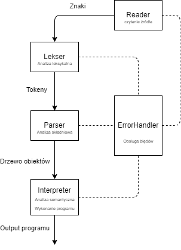

# TKOM - Turtle
Autor: Maciej Tymoftyjewicz

## Cel projektu
Celem projektu jest zaprojektowanie w pełni funkcjonalnego **interpretera** stworzonego przez siebie języka.

Projekt realizowany jest w ramach przedmiotu Techniki Kompilacji - TKOM.

Opiekunem projektu jest dr inż. Piotr Gawkowski.

## Opis języka
Język programowania **Turtle** umożliwia interaktywne tworzenie obrazów poprzez sterowanie żółwiem potrafiącym rysować różnego rodzaju kształty, o zadanym kolorze i wymiarach.

Język jest **słabo** oraz **dynamicznie** typowany. Typy proste są **niemutowalne**, a typy obiektowe - **mutowalne**.

## Typy danych:

    integer - reprezentuje liczbę całkowitą
    double - reprezentuje liczbę niecałkowitą
    null - reprezentuje brak wartości
    boolean - reprezentuje wartośc logiczną: prawda lub fałsz
    string - reprezentuje ciąg znaków

W języku występują także typy złożone, obiekty wbudowane *Turtle*, *Color*, *Pen* oraz *TurtlePosition*

## Dozwolone konstrukcje językowe

### Operator przypisania

    a = b;                  <- Inicjalizacja zmiennej

#### Przykłady:

    length = 10;            <- Zmienna typu integer
    diagonal = 100.75;      <- Zmienna typu double
    v_null = null;          <- Zmienna typu null
    truth = true;           <- Zmienna typu boolean
    text = "Text";          <- Zmienna typu string

### Operatory arytmetyczne

    a + b                   <- dodawanie
    a - b                   <- odejmowanie
    a / b                   <- dzielenie
    a * b                   <- mnożenie
    a ^ b                   <- potęgowanie
    a // b                  <- dzielenie całkowite
    a % b                   <- modulo

  #### Przykłady:

    sum = 10 + 5;
    diff = 10 - 5;
    quot = 10 / 5;
    prod = 10 * 5;
    exp = 10 ^ 5;
    qout_int = 10 // 5;
    modulo = 10 % 5;

### Operatory porównania

    a == b                  <- równe
    a != b                  <- różne
    a > b                   <- większe
    a >= b                  <- większe lub równe
    a < b                   <- mniejsze
    a <= b                  <- mniejsze lub równe

### Operatory logiczne

    a && b                  <- a oraz b
    a || b                  <- a lub b

### Operatory unarne

    !a                      <- nie a
    -a                      <- minus a

### Instrukcje warunkowe

    if(condition){          <- wykonaj jeśli warunek jest prawdą
    ...
    }

    unless(condition){      <- wykonaj jeśli warunek nie jest prawdą
    ...
    }

    else {                  <- wykonaj jeśli poprzednie warunki były fałszywe
    ...
    }

#### Przykłady:

    if(len < 10) {          <- Jeśli len mniejsze od 10
	    res = true;
	} else {                <- W innym wypadku
	    res = false;
	}

### Instrukcje pętli

    while(condition) {      <- pętla wykonywana gdy warunek jest prawdą
    ...
    }

    break                   <- przerwij wykonywanie pętli

    continue                <- przejdź do kolejnej iteracji
#### Przykłady:

    while(i < 5) {
	    j = j + 1;
	    i = i + 1;
	}

### Definiowanie funkcji

    func name(arg1, arg2 ...){   <- Funkcja posiada nazwę oraz przymuje ustaloną liczb argumentów.
	    ...
	    return data;            <- Funkcja może zwracać dane instrukcją return
    }
   Parametry funkcji przekazywane są przez **wartość**, gdy argument jest typu prostego lub **referencję**, gdy argument jest typu obiektowego.
#### Przykłady:

    func sum(a, b) {
	    return a + b;
	}

### Wywoływanie funkcji

    fun_name(arg1, arg2 ...);
#### Przykłady:

    c = sum(a, b);
    d = sum(5, 10);

### Komentarze

    # To jest komentarz...
    a = 5; 		# To również jest komentarz

### Obiekty

    obj.method();		<- wywołanie metody obiektu
    data = obj.attr;	<- dostęp do atrybutu obiektu
    obj.attr = data;	<- przypisanie wartości atrybutu

## Funkcje i obiekty wbudowane

### Funkcje wbudowane

    print(message)		<- Funkcja służąca do wypisywania w konsoli wiadomości lub danych
#### Przykłady:

    print("Wiadomość do użytkownika");
    print(100);
    print(true);

### Obiekty wbudowane

***Turtle*** - obiekt żółwia, jest używany do rysowania kształtów.

Metody:
- *forward(length)* - rysuje prostą linię o długości length
- *right()* - obraca żółwia o 90 stopni w prawo
- *left()* - obraca żółwia o 90 stopni w lewo
- *rotate(angle)* - obraca żółwia o zadany kąt

Atrybuty:
 - *pen* - obiekt typu ***Pen***
 - *position* - obiekt typu ***TurtlePosition***
 - *angle* - kąt pod którym ustawiony jest żółw. Wartość z zakresu 0-359. Kąt zmienia się wedle wskazówek zegara.

Konstruktory:

    Turtle() - tworzy obiekt żółwia z domyślnymi atrybutami (czarnym długopisem, pozycją (x=0, y=0) i zwrotem w kierunku pionowym (angle=0))
    Turtle(pen, position, angle) - tworzy obiekt żółwia z podanymi przez użytkownika atrybutami

***Pen*** - obiekt długopisu, umożliwia modyfikowanie cech linii rysowanych przez żółwia.

Atrybuty:
 - *enabled* - wartość boolowska, reprezentuje informację czy długopis może obecnie rysować.
 - *color* - obiekt typu ***Color***

Konstruktory:

    Pen() - tworzy obiekt długopisu z domyślnymi atrybutami (piszący i czarny)
    Pen(enabled, color) - tworzy obiekt długopisu z podanymi przez użytkownika atrybutami

***TurtlePosition*** - obiekt reprezentujący pozycję żółwia.

Atrybuty:
 - *x* - współrzędna x żółwia
 - *y* - współrzędna y żółwia

Konstruktory:

    Position() - tworzy obiekt pozycji z domyślnymi atrybutami (x=0, y=0)
    Position(x, y) - tworzy obiekt pozycji z podanymi przez użytkownika atrybutami

***Color*** - obiekt reprezentujący kolor długopisu żółwia.

Atrybuty:
 - *a* - przezroczystość (widoczność)
 - *r* - składowa czerwona
 - *g* - składowa zielona
 - *b* - składowa niebieska

Konstruktory:

    Color() - tworzy obiekt koloru z domyślnymi atrybutami (100% widoczności, kolor czarny)
    Color(a, r, g, b) - tworzy obiekt koloru z podanymi przez użytkownika atrybutami

### Przykłady

#### Rysowanie kwadratu:

    func rysuj_kwadrat(zolw, bok) {
	    i = 0;
	    while (i<=3) {
	    	zolw.forward(bok);
	    	zolw.right();
	    	i = i + 1;
	    }
	}

	zolw = Turtle();
	rysuj_kwadrat(zolw, 10);

#### Rysowanie kolorowej linii

    zolw = Turtle();
	zolw.pen.color = Color(100,0,255,0);
	zolw.forward(10);

	zolw.pen.enabled = false;
	zolw.pen.color.r = 255;
	zolw.forward(10);

	zolw.pen.enabled = true;
	zolw.pen.color.g = 0;
	zolw.forward(10);

	zolw.pen.color.b = 255;
	zolw.forward(10);

#### Definiowanie kilku żółwi

    zolw = Turtle();
	zolw.pen.color = Color(100,0,255,0);

	kolor = zolw.pen.color;
	kolor.r = 255;

	zolw2 = Turtle();
	zolw2.pen.color = kolor;
	zolw2.position = zolw.position;

## Niedozwolone konstrukcje językowe

    Wielokrotne użycie operatorów porównania - dozwolone jest porównanie maksymalnie dwóch obiektów w jednym wyrażeniu:
    if (a > b < c > d) ...

	Definiowanie funkcji wewnątrz innej funkcji:
	func foo() {
	    ...
	    func foo_too() {
	    	...
	    }
	...
	}

    Przypisanie wartości do funkcji:
    funcall() = 5;

    Wolnostojący identyfikator lub dostęp do atrybutu:
    ident;
    obj.attr;

## Formalna specyfikacja i składnia EBNF

### Priorytety i łączność operatorów
| Operatory                                      		| Zapis           	| Łączność     	|
|-														|-					|-				|
| Nawiasowania                                   		|        ()       	|  lewostronna 	|
| Dostępu do atrybutu i wywołania funkcji/metody        |       . ()      	|  lewostronna 	|
| Potęgowania                                    		|        ^        	| prawostronna 	|
| Unarne                                        		|        ! -        | prawostronna 	|
| Multiplikatywne                                		|     * / // %    	|  lewostronna 	|
| Addytywne                                      		|       + -       	|  lewostronna 	|
| Relacyjne                                      		| > >= < <= == != 	|  lewostronna 	|
| Koniunkcji                                     		|        &&       	|  lewostronna 	|
| Alternatywy                                    		|       \|\|      	|  lewostronna 	|
| Przypisania                                   		|       =      		| prawostronna 	|

### Gramatyka - EBNF

    LEKSYKA:
    non_zero_digit  = '1' | '2' | '3' | '4' | '5' | '6' | '7' | '8' | '9';
    digit           = '0' | non_zero_digit;
    integer         = '0' | non_zero_digit, {digit};
    double          = integer, '.', {digit};

    boolean         = 'true' | 'false';

    letter          = 'A-Z' | 'a-z';
    escapable       = 't' | 'n' | '"' | '\';
    escaped         = '\', escapable;
    symbol          = "~" | "`" | "!" | "@" | "#" | "$" | "%" | "^" | "&"
	                  | "*" | "(" | ")" | "-" | "_" | "=" | "+" | "[" | "]"
	                  | "{" | "}" | ";" | ":" | "'" | "|" | "," | "<" | "."
	                  | ">" | "/" | "?";
	char            = letter | escaped | symbol | digit | " ";
    string          = '"', {char}, '"';

	identifier      = letter, {letter | digit | "_"};

    assign_op       = '=';
    and_op          = '&&';
    or_op           = '||';
    rel_op          = '>' | '>=' | '<' | '<=' | '==' | '!=';
    add_op          = '+' | '-';
    mult_op         = '*' | '/' | '//' | '%';
    unar_op         = '!' | '-';
    pow_op          = '^';

    terminator      = ';'

    SKLADNIA:
    program             = {instruction};
    instruction         = fun_def;

    fun_def             = 'func', identifier, '(', [params], ')', statement_block;
    statement_block     = '{', {statement}, '}';

	statement           = simple_statement, terminator
	                      | compound_statement

    simple_statement    = obj_access, [assign_statement]
	                      | return_statement
	                      | 'break'
	                      | 'continue';

	compound_statement  = if_statement
	                      | while_statement;

    params              = identifier, {",", identifier}

	obj_access          = member {'.', member };
    member              = identifier, ['(' [args] ')'];
	args                = expression, {",", expression};

    assign_statement    = assign_op, expression;
	return_statement    = 'return', [expression];

	if_statement        = if_kw, '(', expression, ')', statement_block,
	                      ['else', statement_block];
	if_kw               = 'if' | 'unless';

	while_statement     = 'while', '(', expression, ')', statement_block

    expression          = disjunction;
    disjunction         = conjunction, {or_op, conjunction};
    conjunction         = comparison, {and_op, comparison};
    comparison          = sum_sub, [rel_op, sum_sub];
    sum_sub             = term, {add_op, term};
    term                = factor, {mult_op, factor};
    factor              = [unar_op], power;
    power               = primary, {pow_op, primary};
    primary             = parenth_expression | constant | obj_access;

    parenth_expression  = "(", expression, ")";
    constant            = int | double | string | boolean | null;

## Obsługa błędów
Błędy obsługiwane są przed moduł **ErrorHandler**. Same błędy podzielone zostały na trzy kategorie: *Warning*, *Error* oraz *Critical Error*

Schemat komunikatu o błędzie:

    {TYP BŁĘDU} - {KOMUNIKAT}
    line: X col: Y
    {linia kodu}
        ^               <- znak wskazujący na miejsce błędu

Przykład komunikatu o błędzie:

    ERROR - UNEXPECTED EOL WHILE PARSING STRING
    line: 2 col: 17
        ident = "str
                    ^

### Błędy leksykalne
Rozróżniane jest 12 typów błędów leksera.

    ERROR - UNEXPECTED EOL WHILE PARSING STRING

    ERROR - UNEXPECTED EOF WHILE PARSING STRING

    ERROR - EXCEEDING LENGTH OF A STRING!

    ERROR - EXCEEDING LENGTH OF AN IDENTIFIER!

    ERROR - PRECEDING ZERO IN A NUMERIC CONSTANT!

    ERROR - EXCEEDING VALUE OF A NUMERIC CONSTANT (INT)!

    ERROR - EXCEEDING VALUE OF A NUMERIC CONSTANT (DOUBLE)!

    ERROR WHILE PARSING "&&" OPERATOR
    EXPECTED "&" GOT " "

    ERROR - UNRECOGNIZED TOKEN: "@"

    CRITICAL ERROR - ENCOUNTERED TWO DIFFERENT NEWLINE SIGNS - CORRUPTED FILE

    CRITICAL ERROR - NO SUCH FILE OR DIRECTORY

    WARNING - TRIED TO ESCAPE UNESCAPABLE CHARACTER

### Błędy składniowe
Rozróżniane jest 39 typów błędów parsera.

    CRITICAL ERROR - EXPECTED FUNCTION DEFINITION, GOT IDENTIFIER

    ERROR - EXPECTED LEFT BRACE OF FUNCTION PARAMETERS LIST "("

    ERROR - EXPECTED RIGHT BRACE OF FUNCTION PARAMETERS LIST ")"

    CRITICAL ERROR - EXPECTED FUNCTION BLOCK

    CRITICAL ERROR - EXPECTED FUNCTION IDENTIFIER

    ERROR - EXPECTED FUNCTION PARAMETER NAME

    ERROR - DUPLICATE FUNCTION PARAMETER NAME "param"

    ERROR - DUPLICATE FUNCTION NAME "fun"

    ERROR - EXPECTED RIGHT BRACE OF FUNCTION BLOCK "}"

    ERROR - EXPECTED STATEMENT TERMINATOR ";"

    ERROR - EXPECTED LEFT BRACE OF IF/UNLESS CONDITION "("

    CRITICAL ERROR - EXPECTED IF/UNLESS STATEMENT CONDITION

    ERROR - EXPECTED RIGHT BRACE OF IF/UNLESS CONDITION ")"

    CRITICAL ERROR - EXPECTED IF/UNLESS BLOCK

    CRITICAL ERROR - EXPECTED ELSE BLOCK

    ERROR - EXPECTED LEFT BRACE OF WHILE CONDITION "("

    CRITICAL ERROR - EXPECTED WHILE STATEMENT CONDITION

    ERROR - EXPECTED RIGHT BRACE OF WHILE CONDITION ")"

    CRITICAL ERROR - EXPECTED WHILE BLOCK

    CRITICAL ERROR - STANDALONE IDENTIFIER OR MEMBER ACCESS

    CRITICAL ERROR - EXPECTED EXPRESSION WHILE PARSING ASSIGNMENT

    CRITICAL ERROR - ASSIGN OPERATOR CANNOT BE USED ON A FUNCALL

    ERROR - EXPECTED FUNCTION ARGUMENT

    ERROR - EXPECTED RIGHT BRACE OF FUNCTION ARGUMENTS LIST ")"

    ERROR - EXPECTED MEMBER NAME WHILE PARSING OBJECT MEMBER ACCESS

    ERROR - EXPECTED RIGHT BRACE WHILE PARSING PARENTH EXPRESSION ")"

    CRITICAL ERROR - EXPECTED EXPRESSION WHILE PARSING DISJUNCTION

    CRITICAL ERROR - EXPECTED EXPRESSION WHILE PARSING ADDITION

    CRITICAL ERROR - EXPECTED EXPRESSION WHILE PARSING CONJUNCTION

    CRITICAL ERROR - EXPECTED EXPRESSION WHILE PARSING DIVISION

    CRITICAL ERROR - EXPECTED EXPRESSION WHILE PARSING MULTIPLICATION

    CRITICAL ERROR - EXPECTED EXPRESSION WHILE PARSING COMPARISON

    CRITICAL ERROR - EXPECTED EXPRESSION WHILE PARSING SUBTRACTION

    CRITICAL ERROR - EXPECTED EXPRESSION WHILE PARSING EXPONENTIATION

    CRITICAL ERROR - EXPECTED EXPRESSION WHILE PARSING NEGATION

    CRITICAL ERROR - EXPECTED EXPRESSION WHILE PARSING INTEGER DIVISION

    CRITICAL ERROR - EXPECTED EXPRESSION WHILE PARSING MODULO OPERATION

    CRITICAL ERROR - ENCOUNTERED TOO MANY COMPARISONS IN SINGLE STATEMENT

### Błędy semantyczne

    CRITICAL ERROR - MISSING MAIN FUNCTION DEFINITION

    CRITICAL ERROR - MAIN FUNCTION CANNOT HAVE PARAMETERS

    CRITICAL ERROR - FUNCTION "fun" IS NOT DEFINED

    CRITICAL ERROR - FUNCTION "fun" TAKES EXACTLY 5 ARGUMENTS, 2 GIVEN

    CRITICAL ERROR - VARIABLE "var" IS NOT DEFINED

    CRITICAL ERROR - ADDITION IS NOT SUPPORTED FOR TYPES integer AND boolean

    CRITICAL ERROR - SUBTRACTION IS NOT SUPPORTED FOR TYPES integer AND boolean

    CRITICAL ERROR - DIVISION IS NOT SUPPORTED FOR TYPES integer AND boolean

    CRITICAL ERROR - INTEGER DIVISION IS NOT SUPPORTED FOR integer AND boolean

    CRITICAL ERROR - MODULO IS NOT SUPPORTED FOR TYPES integer AND boolean

    CRITICAL ERROR - MULTIPLICATION IS NOT SUPPORTED FOR TYPES integer AND boolean

    CRITICAL ERROR - EXPONENTIATION IS NOT SUPPORTED FOR TYPES integer AND boolean

    // Operacje AND oraz OR są możliwe dla każdego obecnie istniejącego typu danych, jednak w wypadku, gdyby w przyszłości dodany został typ, dla którego by tak nie było - istnieje taki błąd.
    CRITICAL ERROR - CONJUNCTION IS NOT SUPPORTED FOR TYPES X AND Y

    CRITICAL ERROR - DISJUNCTION IS NOT SUPPORTED FOR TYPES X AND Y

    CRITICAL ERROR - NEGATION IS NOT SUPPORTED FOR TYPE $

    CRITICAL ERROR - LOGICAL NEGATION IS NOT SUPPORTED FOR TYPE $

    CRITICAL ERROR - "EQUAL" COMPARISON IS NOT SUPPORTED FOR TYPES $ AND $

    CRITICAL ERROR - "NOT EQUAL" COMPARISON IS NOT SUPPORTED FOR TYPES $ AND $

    CRITICAL ERROR - "GREATER" COMPARISON IS NOT SUPPORTED FOR TYPES $ AND $

    CRITICAL ERROR - "GREATER OR EQUAL" COMPARISON IS NOT SUPPORTED FOR TYPES $ AND $

    CRITICAL ERROR - "LESSER" COMPARISON IS NOT SUPPORTED FOR TYPES $ AND $

    CRITICAL ERROR - "LESSER OR EQUAL" COMPARISON IS NOT SUPPORTED FOR TYPES $ AND $

    CRITICAL ERROR - DIVISION BY ZERO!

    CRITICAL ERROR - EXPECTED TYPES [$] IN OBJECT CONSTRUCTOR. GOT ARGUMENTS OF TYPES [$]

    CRITICAL ERROR - BREAK AND CONTINUE STATEMENT ARE ONLY LEGAL INSIDE A LOOP

    CRITICAL ERROR - PROPERTY '$' DOESN'T EXIST ON TYPE '$'

    CRITICAL ERROR - METHOD '$' DOESN'T EXIST ON TYPE '$'

    CRITICAL ERROR - PRIMITIVE OBJECT TYPE '$' DOESN'T HAVE ANY PROPERTIES

    CRITICAL ERROR - PRIMITIVE OBJECT TYPE '$' DOESN'T HAVE ANY PROPERTIES

    CRITICAL ERROR - EXPECTED TYPE '$' IN '$' PROPERTY ASSIGNMENT. GOT ARGUMENT OF TYPE '$'

    CRITICAL ERROR - ENCOUNTERED REDEFINITION OF BUILTIN FUNCTION $!

    CRITICAL ERROR - ENCOUNTERED REDEFINITION OF BUILTIN CONSTRUCTOR $!

    WARNING - COLOR OPACITY EXCEEDED VALUE LIMIT (0-100). SETTING TO $

    WARNING - COLOR $ COMPONENT EXCEEDED VALUE LIMIT (0-255). SETTING TO $

    WARNING - ENCOUNTERED INT OVERFLOW! SETTING TO MAX INTEGER VALUE.

    WARNING - ENCOUNTERED DOUBLE OVERFLOW! SETTING TO MAX DOUBLE VALUE.

## Sposób uruchomienia, wej./wyj.
Program uruchamiany jest przy użyciu specjalnego skryptu przyjmującego jako argument plik tekstowy zawierający kod programu.

Możliwe jest włączenie programu przy użytciu dwóch skryptów:

- ***turtle.sh*** - podany kod jest interpetowany, po czym, jeśli w wykonanym programie użyto tworzenia linii wyświetlany jest stworzony obraz. Przykładowe uruchomienie:

    ./turtle.sh code_snippets/text.txt
- ***turtle-test.sh*** - kod jest interpretowany oraz na ekran wypisana zostaje struktura wygenerowanego programu. Nie dochodzi do rysowania obrazu. Przykładowe uruchomienie:

    ./turtle-test.sh code_snippets/text.txt

## Analiza wymagań
1. Program będzie w stanie przeanalizować i wykonać poprawnie skonstruowane instrukcje w zdefiniowanym języku.

    **Realizacja**: Zaimplementowane zostały lekser, parser oraz interpreter skutecznie analizujące i wykonujące kod napisany w zdefiniowanym języku.

2. Język będzie umożliwiał rysowanie kształtów w wyświetlanym dla użytkownika oknie.

    **Realizacja**: Wbudowane w język metody obiektu *Turtle* pozwalają na rysowanie linii na płótnie, wyświetlanym użytkownikowi w oknie przeglądarki.

2. Możliwa będzie modyfikacja:
   - koloru linii
   - długości linii
   - kierunku (kąta) rysowania
   - pozycji, z której rozpoczyna się rysowanie

    **Realizacja**: Wbudowane obiekty posiadają atrybuty pozwalające na modyfikację cech rysowanych linii.

3. Program będzie informował użytkownika o pomyłkach w kodzie pod postacią komunikatu o błędzie. Ponadto przekazana zostanie użytkownikowi informacja o miejscu wystąpienia błędu (linia oraz kolumna) wraz z zawierającą go częścią kodu.

    **Realizacja**: Każdy błąd popełniony przez użytkownika w pisaniu kodu wyświetlany jest mu w postaci ostrzeżenia lub błędu (czasem krytycznego). Każdy rodzaj błędu ma zdefiniowany specjalny komunikat, a błędy, z którymi powiązana jest pozycja w kodzie, przesyłane są użytkownikowi wraz z informacją o ich pozycji w kodzie (linia oraz kolumna), możliwie wraz z kodem linii w której doszło do błędu.

4. Zaimplementowane będą mechanizmy zabezpieczające przed błędami, takie jak maksymalna długość tokenu, graniczne wartości stałych liczbowych i maksymalna długość łańcucha znaków.

    **Realizacja**: Analizator leksykalny posiada zdefiniowane maksymalne wartości liczbowe integer i double, graniczną długość ciągu znaków oraz identyfikatora. W przypadku ich przekroczenia zgłaszany jest błąd, a nadmiarowe części tych struktur są ignorowane.

5. Możliwe będzie zatrzymanie wykonania programu przy użyciu skrótu klawiszowego.

    **Realizacja**: Wykonanie programu można przerwa przy użyciu skrótu klawiszowego CTRL+C.

6. Program uniemożliwi zdefiniowanie dwóch funkcji o tych samych nazwach.

    **Realizacja**: Zdefiniowanie dwóch funkcji o tej samej nazwie, lub funkcji o nazwie tożsamej z nazwą funkcji wbudowanej (lub konstruktora obiektu) wywołuje błąd.

7. Zmienne definiowane w języku będą miały określony kontekst oraz zasięg.

    **Realizacja**: Każda funkcja w języku posiada swój własny kontekst w ramach którego definiowane są zmienne. Będąc w jednym kontekście, niemożliwy jest dostęp do zmiennych z innego (poprzedniego, nadrzędnego) kontekstu. Dodatkowo każdy blok wyrażeń (blok pętli while, bloki struktur if/unless oraz blok funkcyjny) ma własny zasięg zmiennych. W przypadku zasięgu możliwy jest dostęp do zmiennych definiowanych w ramach poprzednich (nadrzędnych) zasięgów, jednak granicę stanowi kontekst funkcji. Innymi słowy, będąc przykładowo w pętli while można dostać się do wartości zdefiniowanych wcześniej poza nią, jednak tylko w granicy danej funkcji.

8.  Będzoe istnieć możliwość ewaluacji "short-circuit" operacji logicznych.

    **Realizacja**: Zaimplementowana ewaluacja operacji logicznych AND oraz OR pozwala na zoptymalizowane wyliczanie ich wartości. Ewaluacja operandów odbywa się od lewej do prawej. W przypadku gdy wartość ewaluacji jednego z nich jest wystarczająca do uznania poprawności wyrażenia, dalsze operandy nie są ewaluowane.

    W przypadku operatora OR, jeśli lewy operand "jest prawdziwy", jest to wystarczające do stwierdzenia, że całe wyrażenie jest prawdziwe. Za to w przypadku operatora AND, jeśli lewy operand "jest fałszywy", oznacza to, że całe wyrażenie jest fałszywe.

9.  Język będzie wspierać UTF-8

    **Realizacja**: Stworzony Reader źródła tekstu obsługuje czytanie znaków w formacie UTF-8 i jest w stanie je poprawnie przekazać do leksera.

## Sposób realizacji
Poniżej znajduje się graf zależności najważniejszych modułów systemu.

Do **leksera** trafiają szeregowo znaki z kodu źródłowego, które są analizowane leksykalnie i tokenizowane.
Wyprodukowane tokeny trafiają następnie do **parsera**, który dokonuje analizy składniowej i buduje na ich podstawie drzewo obiektów programu.
Ostatecznie **interpreter** wykonuje program sprawdzając przy okazji poprawność semantyczną.
Dodatkowo moduł **obsługi błędów**, komunikujący się z każdym z wymienionych komponentów, będzie odpowiedzialny za informowanie użytkownika o występujących w kodzie błędach i w przypadku, gdy zajdzie taka potrzeba - przerwanie wykonania programu.

### Lekser
Lekser pobiera znaki leniwie, pojedynczo znak po znaku. Odpowiednio skonstruowane wedle zasad języka ciągi znaków grupowane są w tokeny. W przypadku, gdy niemożliwe jest zidentyfikowanie tokenu lub łamane jest któreś z istniejących zabezpieczeń (np. na wartość stałej liczbowej) wywoływany jest błąd. W zależności od krytyczności błędu, może być możliwe kontynuowanie wykonania programu, aby zapewnić bardziej obszerną analizę.

Lekser komunikuje się z modułem **Reader** w celu czytania znaków z pliku, **ErrorHandler** aby zgłaszać błędy, **Token** aby dokonywać tokenizacji oraz **Misc** do przeprowadzania pomniejszych operacji, takich jak np. użycie wyrażeń regularnych.

##### Typy tokenów
 - IDENTIFIER
 - INT
 - DOUBLE
 - STRING
 - KEYWORDS
	 - FUN_KW
	 - RET_KW
	 - WHILE_KW
	 - BREAK_KW
	 - CONTINUE_KW
	 - TRUE_KW
	 - FALSE_KW
	 - NULL_KW
	 - IF_KW
	 - ELSE_KW
	 - UNLESS_KW
 - ARITHMETIC
	 - ASSIGN_OP
	 - ADD_OP
	 - MULT_OP
	 - DIV_OP
	 - DIV_INT_OP
	 - POW_OP
	 - MOD_OP
 - COMPARISON
	 - EQ_OP
	 - NEQ_OP
	 - GRT_OP
	 - GRT_EQ_OP
	 - LESS_OP
	 - LES_EQ_OP
 - LOGICAL
	 - AND_OP
	 - OR_OP
 - UNARY
	 - NOT_OP
	 - MINUS_OP
 - DOT_OP
 - L_BRACE
 - L_C_BRACE
 - R_BRACE
 - R_C_BRACE
 - COMMA
 - SEMICOL
 - EOF
 - COMMENT (filtrowane między lekserem a parserem)
 - UNRECOGNIZED (filtrowane między lekserem a parserem)

### Parser
Analizator składniowy wykorzystując **Lekser** dostaje po kolei kolejne tokeny otrzymane w ramach tokenizacji. Sprawdza on poprawność składniową sekwencji tokenów oraz na ich podstawie buduje zgodne z gramatyką drzewo obiektów reprezentujących poszczególne konstrukcje językowe. Dokonuje również kilka dodatkowych akcji semantycznych. Możliwe błędy występujące w trakcie analizy są zgłaszane do **ErrorHandlera** i przedstawiane użytkownikowi.

#### Konstrukcje językowe z przypisanymi typami obiektów
- Program (Program)
- Definicja funkcji (FunctionDef)
- Blok (Block)
- Wyrażenia (Expression)
  - Addytywne (Additive)
    - Dodawanie (Addition)
    - Odejmowanie (Subtraction)
  - Komparatywne
    - Równość (EqualComparison)
    - Nierówność (NotEqualComparison)
    - Większość (GreaterComparison)
    - Większość-Równość (GreaterEqualComparison)
    - Mniejszość (LesserComparison)
    - Mniejszość-Równość (LesserEqualComparison)
  - Multiplikatywne
    - Dzielenie (Division)
    - Dzielenia całkowitoliczbowe (IntDivision)
    - Modulo
    - Mnożenie (Multiplication)
  - Negacje
    - Negacja (Negation)
    - Logiczna negacja (LogicalNegation)
  - Podstawowe
    - Stałe
      - Logiczna (BooleanConstant)
      - Całkowitoliczbowa (IntConstant)
      - Niecałkowitoliczbowa (DoubleConstant)
      - Null (NullConstant)
      - Ciąg znaków (StringConstant)
    - Dostęp do pól obiektów (ObjectAcccess)
  - Logiczne
    - Koniunkcja (AndExpression)
    - Alternatywa (OrExpression)
  - Potęgowanie (Exponentiation)
- Statementy (Statement)
  - Przypisanie (AssignmentStatement)
  - Break (BreakStatement)
  - Continue (ContinueStatement)
  - If (IfStatement)
  - Unless (UnlessStatement)
  - Return (ReturnStatement)
  - While (WhileStatement)

### Interpreter
Po pełnej analizie składniowej kodu, interpreter zaczyna wykonywać kod, przy czym sprawdza również poprawność semantyczną wygenerowanych struktur składniowych. Dokonuje niejawnych konwersji typów, sprawdza poprawności typów, legalność operacji oraz korekty wartości zmiennych. Błędy zgłaszane przez interpreter w trakcie wykonania są krytyczne i przerywają wykonanie programu.

Interpreter komunikuje się z modułem **Environment** w celu zarządzania zasięgiem oraz kontekstem, **TypeMatching** do sprawdzania poprawności typów, **Evaluator** żeby obliczać wartości operacji.

## Testowanie
Program testowany jest przy użyciu biblioteki JEST.
Powstały łącznie **483** testy działania poszczególnych modułów aplikacji.

Uruchomienie komendą **jest**

### Lekser
Poprawne działanie **leksera** sprawdzanie jest przy użyciu testów jednostkowych weryfikujących wykrywanie pojedynczych tokenów (zarówno poprawnych jak i niepoprawnych). Testy niepoprawne są przeprowadzane między innymi korzystając z typowych błędów, które mogą przydarzyć się podczas pisaniu kodu, np. literówka, lub brak domknięcia cudzysłowia.

Dla każdej produkcji **parsera** powstał test sprawdzający jej poprawność.  Dodatkowo przeprowadzone zostały testy dla scenariuszy nieprawidłowych sekwencji tokenów.

**Interpreter** sprawdzany jest poprzez testowanie pełnego potoku przetwarzania na podstawie łańcucha znaków. Sprawdzone zostały wszystkie legalne konstrukcje językowe, typowe sytuacje błędne, sposoby wykonywania kodu i dostępu do zmiennych itd.

Inne moduły aplikacji, takie jak: **Reader**, **TypeMatching**, **Evaluator** oraz **Misc** testowane były przy użyciu testów jednostkowych.
